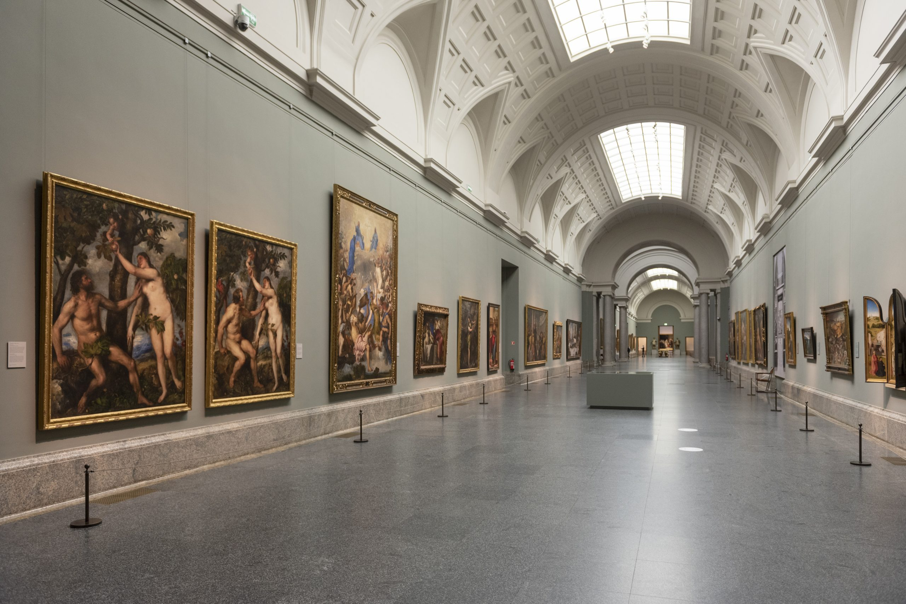
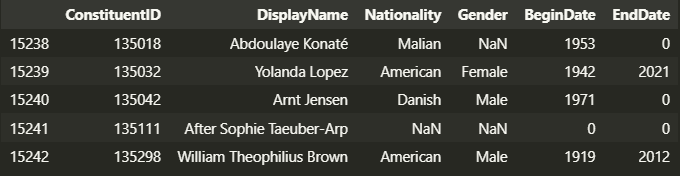
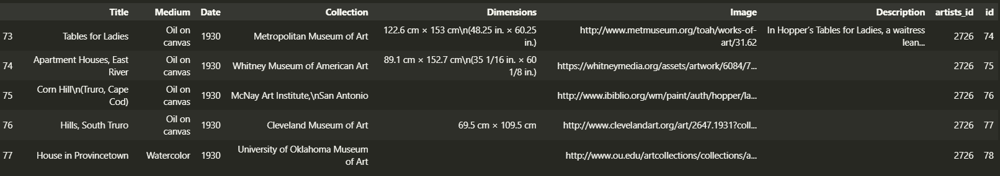
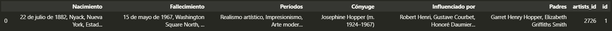
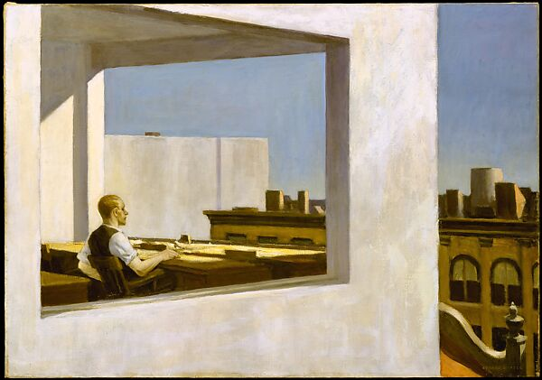

# Meta Artists

## Proceso de ETL

## Índice:

1.[✍️ Descripción](#descripción)\
2.[🔍 Extracción](#extracción)\
3.[🎙️ Transformación](#tranformación)\
4.[💿 Load](#load)\
5.[🔮 A futuro](#futuro)\
5.[🗂️ Estructura](#estructura)

## ✍️ Descripción:<a name="descripción"/>

Proyecto en Ironhack 🔗  Se propone poner en práctica el proceso completo de ETL (extracción, transformación y limpieza) con temática libre. Para ello hay un par de requisitos:

- Tiene que haber mínimo tres fuentes de extracción.

- Se requiere la utiliazción de al menos dos métodos de extracción.

Así, desde el primer momento de búsqueda, se nos hizo complicado encontrar una database que contuviese datos sobre artistas que no fuesen Bob Ross o Van Gogh así que nos atrevimos a empezar el proceso de crear una megadatabase sobre arte. Para ello, hemos creado este prototipo de cómo se podría ir rellenando desde una base simple de tres tablas que explicaremos a continuación.

## 🔍 Extracción:<a name="extracción"/>

Para la obtención de la data hemos explorado en diferentes páginas buscando una tabla que contuviese el mayor número posible de artistas. En [kaggle](https://www.kaggle.com/) encontramos un archivo csv con casi 16.000 artistas que nos pareció adecuado para comenzar. 

Partiendo de ahí, empezaría la búsqueda por artista para completar su información. Debido a nuestro interés por su obra elegimos a Edward Hopper. De él pudimos sacar información desde diferentes webs:

- [Wikipedia](https://en.wikipedia.org/wiki/Edward_Hopper)

Scrapeada con selenium para la creación de una tabla con todas sus obras e info sobre ellas.

- [Web del MET](https://www.metmuseum.org/)

Utilizada mediante scrapeo para info descriptiva de las obras.

- [Google](https://www.google.com/search?q=edward+hopper&sxsrf=APwXEdfRDCPSb-kwJeEGkvVsFHtleGOijQ%3A1683586208022&ei=oHxZZMt6_aKR1Q-5oI-oDA&ved=0ahUKEwjLyoKv5-b-AhV9UaQEHTnQA8UQ4dUDCA8&uact=5&oq=edward+hopper&gs_lcp=Cgxnd3Mtd2l6LXNlcnAQAzIMCCMQigUQJxBGEPsBMgQIIxAnMgcIIxCKBRAnMg0ILhCDARCxAxCKBRBDMgcIABCKBRBDMgYIABAHEB4yBggAEAcQHjIKCAAQgAQQFBCHAjIOCC4QgAQQxwEQrwEQ1AIyBQgAEIAEOgoIABBHENYEELADOgQIABBHOgcIIxCwAhAnOggIABAIEAcQHkoECEEYAFCVLFi0MWCWM2gBcAJ4AIABXogBsQSSAQE3mAEAoAEByAEHwAEB&sclient=gws-wiz-serp)

Con Selenium pudimos obtener info biográfica sobre él.

## 🎙️ Transformación:<a name="tranformación"/>

Con las fuentes mencionadas previamente se llevó un proceso de transformación, completementación y limpieza de datos. 

- TABLA ARTISTS: se eliminaron columnas no funcionales para nuestro proyecto y se le cambió el nombre a otras para mejor comprensión.

- TABLA ART: se creó la tabla con columnas relevantes sobre las obras, fue la parte más tediosa pero conseguimos añadirle una foto a cada una de ellas y añadimos una columna que la relacionará con el artista.

- TABLA BIOGRAPHY: esta tabla contiene info más biográfica de los artistas, se le añadió la columna de realción con el artista.

## 💿 Load:<a name="load"/>

La carga de los datos la hemos realizado convirtiendo las tablas limpias a csv e importándolas a SQL. En un principio, la organización de nuestro dataframe será de la siguiente forma:

## 🔮 A futuro:<a name="futuro"/>

Como se mencionaba al inicio, esto es el prototipo del comiezo de recolección de datos para una base mucho más amplia. Se ha empezado por un artista pero la idea es que se fuesen rellenado todos los de la lista y tener un database completo.

## 🗂️ Estructura:<a name="estructura"/>

root 

|__ data/              # data y tranformaciones

|__ src/               # primera conexión con mongo

|__ 
|

|__ images/             # Contiene la imágenes que se han usado en el proyecto   
|

|__ .gitignore          # Archivo gitignore     
|

|__ README.md           # Descripción del proyecto
